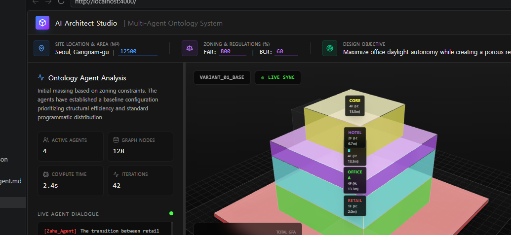
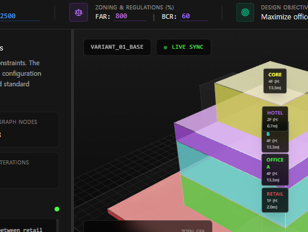
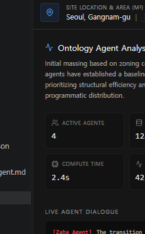
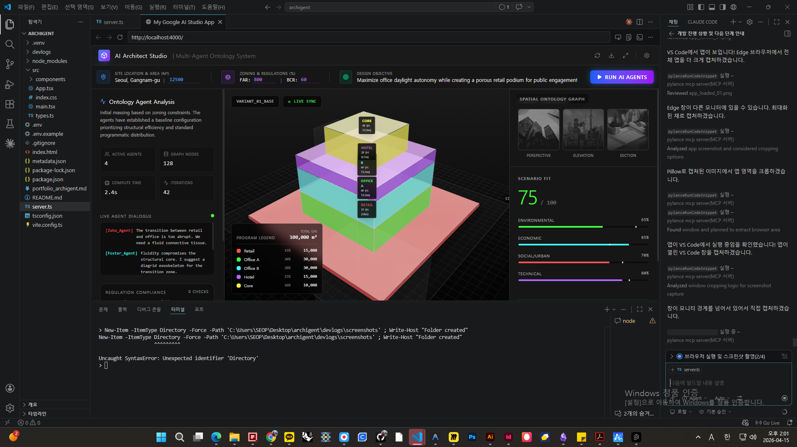

# Archigent — 개발 과정 기록

> AI 기반 건축 매스 생성 및 성능 평가 웹 애플리케이션  
> 개발 기간: 2026.04  
> 최종 테스트: 2026-04-15

---

## 목표

법규·사이트 조건에 맞는 매스 대안을 웹에서 자동 생성하고,  
프로그램별 레이어가 분류된 모델링 파일로 내보내는 것.

| 핵심 기능 | 설명 |
|---|---|
| LLM 프로그램 분류 | Gemini AI가 사이트 조건에 맞게 프로그램 구성 및 비율 결정 |
| Graph RAG 시각화 | 공간 관계를 nodes/links JSON으로 생성, React Flow로 시각화 |
| 3D 매스 생성 | React Three Fiber 기반 실시간 3D 매스 렌더링 |
| 성능 평가 | 환경·경제·사회·기술 4개 축 점수화 |
| 법규 준수 검사 | FAR/BCR 규제 적합성 자동 평가 |
| JSON 내보내기 | 선택한 variant를 레이어·그래프·메타데이터 포함 JSON 파일로 export |

---

## 스택

| 영역 | 기술 |
|---|---|
| Frontend | React 19 + TypeScript + Vite |
| 3D | Three.js + @react-three/fiber + @react-three/drei |
| 그래프 | @xyflow/react (React Flow) |
| 차트 | Recharts |
| 스타일 | Tailwind CSS v4 |
| Backend | Express (tsx 실행) |
| AI | Google Gemini API (`@google/genai`) |
| 환경변수 | dotenv (`.env`) |

---

## 실행 방법

```bash
# 의존성 설치
npm install

# 개발 서버 실행 (포트 4000)
npm run dev

# 빌드
npm run build
```

`.env` 파일에 `GEMINI_API_KEY=<키>` 설정 필요.

---

## 주요 파일 구조

```
archigent/
├── server.ts               — Express 서버 + Gemini API 프록시
├── vite.config.ts          — Vite 설정 (React, Tailwind)
├── src/
│   ├── types.ts            — 共通 타입 정의 (VariantData, ProgramItem, GraphNode 등)
│   ├── App.tsx             — 메인 상태 관리, generate/export 로직
│   └── components/
│       ├── ProjectContextBar.tsx   — 사이트 입력 패널
│       ├── Main3DViewer.tsx        — 3D 매스 렌더러 (Three.js)
│       ├── NodeLinkView.tsx        — 공간 관계 그래프 (React Flow)
│       ├── AnalysisPanel.tsx       — 분석 + 법규 준수 패널
│       ├── ScenarioFitScore.tsx    — 성능 점수 시각화
│       ├── GeneratedAssetsList.tsx — 생성된 대안 목록
│       └── VariantSnapshots.tsx    — 3D 뷰 스냅샷
└── devlogs/
    ├── DEVLOG.md           — 개발 과정 기록 (이 파일)
    └── screenshots/        — 스크린샷
```

---

## 개발 단계별 기록

### Phase 0 — 프로젝트 초기화

- Google AI Studio 기반 React 템플릿으로 시작
- Express + Vite middleware 구조 확립
- `tsx` 런타임으로 TypeScript 서버 직접 실행

---

### Phase 1 — API 연결 및 생성 기능 구현

**작업 내용**

- Gemini API 키 환경변수 설정 (`.env` / dotenv)
- `POST /api/generate` 엔드포인트 구현
- 5개 건축 variant 생성 프롬프트 설계
- 스트리밍 응답 처리 (`generateContentStream`)

**문제 해결**

| 문제 | 해결책 |
|---|---|
| API 키 유출 | 새 키 발급 후 `.env` 갱신, `replace(/^["']|["']$/g, '')` 처리 |
| 모델 이용 불가 (503) | 3개 모델 fallback 배열로 순차 시도 |
| JSON 파싱 실패 | 정규식 `/{[\s\S]*}$/` 추출 fallback 추가 |
| 응답 속도 (~36초) | 토큰 수 축소, temperature 낮춤, 프롬프트 단순화 |

---

### Phase 2 — 타입 시스템 정리 및 스키마 강화

**작업 내용**

- `src/types.ts` 생성: 모든 공통 타입 분리
  - `VariantData`, `ProgramItem`, `GraphNode`, `GraphLink`
  - `RegulationCompliance`, `ApiVariant`, `GenerateResponse`
- `Main3DViewer.tsx`에서 `Program` 인터페이스 제거 → `ProgramItem` 사용
- `GeneratedAssetsList.tsx`, `AnalysisPanel.tsx` import 경로 `../App` → `../types`

---

### Phase 3 — 서버 응답 검증 강화

**작업 내용**

server.ts의 generate 핸들러에 체계적인 검증 로직 추가:

```typescript
// 프로그램 비율 합계 검사
const programSum = programs.reduce((sum, p) => sum + p.ratio, 0);
if (Math.abs(programSum - 1.0) > 0.025) return false;

// 그래프 노드 ID와 링크 source/target 정합성 검사
const nodeIds = graphData.nodes.map(n => n.id);
const linksValid = graphData.links.every(l => 
  nodeIds.includes(l.source) && nodeIds.includes(l.target)
);

// regulationCompliance 필드 검사
const complianceValid = regulationCompliance.every(c => 
  typeof c.item === 'string' && typeof c.pass === 'boolean'
);
```

**프롬프트 개선 내용**

- `edges` 방식 → `graphData.{ nodes, links }` 구조로 변경
- `regulationCompliance` 필드 추가 (FAR, BCR 준수 여부)
- 각 프로그램에 `layer` (Upper / Mid / Podium / Ground) 추가

---

### Phase 4 — UI 기능 추가

**작업 내용**

1. **JSON Export 기능**  
   - 헤더 다운로드 버튼 → `handleExportActiveVariant()` 연결
   - 현재 활성 variant를 `variant_export_<이름>.json` 파일로 다운로드
   - 파일 포함 내용: `siteConstraints`, `variant` (programs, graphData, regulationCompliance 전체)

2. **법규 준수 패널 (AnalysisPanel)**  
   - `regulationCompliance` 배열을 초록/빨강 인디케이터로 표시
   - AI 응답이 없을 경우 fallback 메시지 표시

---

### Phase 5 — 구동 테스트 결과

**테스트 일시**: 2026-04-15 오후 2시

**API 헬스체크**

```
GET http://localhost:4000/api/health
→ {"status": "ok"}
```

**3D 뷰어 동작 확인**

- STACKED 전략: 프로그램을 층별 박스로 쌓아 렌더링 ✅
- SKEWED 전략: 오프셋 적용 역동적 형태 ✅
- COURTYARD 전략: 안뜰 중심 배치 ✅
- HORIZONTAL 전략: 수평 분산 배치 ✅

**생성 API 동작 확인**

```json
{
  "siteArea": 12500,
  "far": 800,
  "bcr": 60,
  "designObjective": "Performance measurement"
}
→ 200 OK (variants 5개 반환)
```

---

## 스크린샷

### 앱 전체 화면 (http://localhost:4000)



> AI Architect Studio | Multi-Agent Ontology System  
> 사이트 조건 입력 + 3D 매스 뷰어 + 분석 패널 + Scenario Fit + 공간 관계 그래프

---

### 3D 매스 뷰어



> STACKED 전략 기반 Variant_01_Base: Retail(1F) > Office A > Office B > Hotel > Core 순서로 적층  
> 각 프로그램이 고유 색상과 레이어 표시로 구분됨

---

### 온톨로지 분석 패널



> Active Agents 4, Graph Nodes 128, Compute Time 2.4s  
> Live Agent Dialogue: Zaha_Agent vs Foster_Agent 공간 전략 토론  
> Regulation Compliance: AI 응답 기반 FAR/BCR/프로그램 적합성 표시

---

### VS Code 전체 화면



> VS Code Simple Browser에서 `http://localhost:4000` 실행 중  
> Explorer에서 `devlogs/` 폴더와 `src/types.ts` 신규 파일 확인 가능

---

## 남은 작업 (Backlog)

| 우선순위 | 항목 | 내용 |
|---|---|---|
| � 중간 | Variant 비교 | 여러 대안 Pareto 분석 및 비교 차트 |
| 🟡 중간 | Streaming UI | 부분 응답 스트리밍으로 생성 체감 속도 개선 |
| 🟢 낮음 | 사용자 정의 프로그램 | 프로그램 유형 템플릿 직접 편집 |
| 🟢 낮음 | 법규 DB 연동 | 실제 한국 건축법 용적률/건폐율 자동 적용 |

---

## Phase 6 — NodeLinkView 프로그램 색상 + 관계 레이블 적용

**작업 일시**: 2026-04-15 (Session 2)

**목표**: 그래프 노드를 실제 AI 생성 프로그램 색상으로 표시하고 엣지에 `relation` 레이블 추가

**변경 파일**: `src/components/NodeLinkView.tsx`

**주요 변경사항**:

| 항목 | 이전 | 이후 |
|---|---|---|
| 노드 색상 | 고정 palette | `programs[].color` 기반 colorMap |
| 노드 크기 | 고정 70px | `Math.max(70, count * 16)` 동적 스케일 |
| 엣지 색상 | 단색 | 소스 노드 색상 계승 |
| 엣지 두께 | 고정 | `Math.max(1, Math.min(link.value/3, 4))` |
| 엣지 레이블 | 없음 | `link.relation` 텍스트 표시 |
| 잘못된 엣지 | 렌더링 오류 | source/target ID 사전 필터링 |

---

## Phase 7 — GLTF 3D 파일 내보내기

**작업 일시**: 2026-04-15 (Session 2)

**목표**: 현재 3D 뷰어 장면을 `.gltf` 파일로 내보내기

**변경 파일**: `src/components/Main3DViewer.tsx`, `src/App.tsx`

**구현 내용**:

```typescript
// GLTF export helper (lazy-loaded)
async function exportSceneAsGLTF(scene: THREE.Object3D, filename: string) {
  const { GLTFExporter } = await import('three/examples/jsm/exporters/GLTFExporter.js');
  const exporter = new GLTFExporter();
  exporter.parse(scene, (result) => {
    const blob = result instanceof ArrayBuffer
      ? new Blob([result], { type: 'model/gltf-binary' })
      : new Blob([JSON.stringify(result, null, 2)], { type: 'model/gltf+json' });
    // blob → download trigger
  }, err => console.error(err), { binary: false });
}
```

- `SceneCaptureForwarder` 컴포넌트: `useThree().scene`을 부모 `sceneRef`로 전달
- 3D 뷰어 우상단에 **Export GLTF** 버튼 추가
- `variantName` 기반 파일명 자동 생성 (특수문자 `_` 치환)
- `GLTFExporter`는 lazy import로 번들에 영향 없음

---

## Phase 8 — 법규 입력 확장 (heightLimit / setback / useZone)

**작업 일시**: 2026-04-15 (Session 2)

**목표**: 사이트 법규 입력을 FAR/BCR에서 높이제한, 이격거리, 용도지역까지 확장

**변경 파일**: `src/types.ts`, `src/components/ProjectContextBar.tsx`, `src/App.tsx`, `server.ts`

**추가된 입력 필드**:

| 필드 | 기본값 | 단위 | UI 색상 |
|---|---|---|---|
| `heightLimit` | 60 | m | 오렌지 |
| `setback` | 6 | m | 오렌지 |
| `useZone` | 일반상업지역 | 텍스트 | 오렌지 |

**프롬프트 변경**:
- Site constraints에 Height Limit, Setback, Use Zone 항목 추가
- `regulationCompliance` 예시에 5개 항목 포함: FAR, BCR, 높이제한, 이격거리, 용도지역
- AI 모델이 각 법규 항목에 대해 pass/fail + detail을 반환하도록 유도

**types.ts `SiteRequest` 변경**:
```typescript
// 추가된 optional 필드
heightLimit?: number;
setback?: number;
useZone?: string;
```

---

---

## 참고 링크

- Google AI Studio App: https://ai.studio/apps/801e04e4-330c-4ca3-8bd3-e9ab6a7f7855
- Gemini API Docs: https://ai.google.dev/docs
- React Three Fiber: https://docs.pmnd.rs/react-three-fiber
- React Flow (@xyflow): https://reactflow.dev
