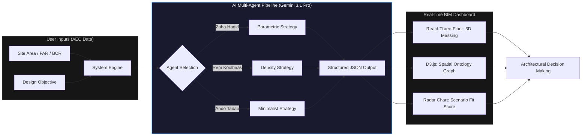

# Archigent: AI Multi-Agent Architecture Ontology Studio

## 1. Summary & Business Impact (요약 및 비즈니스 임팩트)
- **한 줄 소개**: 건축가별 디자인 철학(Ontology)과 법규적 제약 조건을 결합해 초기 기획 설계안을 10분 만에 다각도로 제안하는 **Generative BIM Pre-design Pipeline**입니다.
- **문제 정의(Problem)**: 건축 설계의 초기 기획(Feasibility Study) 단계에서 대지 분석과 대안(Option-neering) 수립은 건축가의 수작업에 의존하며 수일~수주가 소요됩니다. 특히 FAR(용적률)과 BCR(건폐율)을 맞추면서도 창의적인 매싱(Massing)을 도출하는 과정에서 효율성이 극도로 저하됩니다.
- **해결 방안(Solution)**: LLM(Gemini)을 '멀티 에이전트'로 활용하여 자하 하디드, 렘 쿨하스 등 세계적인 건축가 5인의 디자인 논리(Star-architect Ontologies)를 시스템에 주입했습니다. 사용자가 제약 조건과 설계 목표를 입력하면 AI가 법규를 준수하는 프로그램 배치, 공간 그래프, 3D 매싱 전략을 즉각적으로 생성합니다.
- **비즈니스 임팩트**: 기존 실무 기준 **72시간 이상 소요되던 초기 기획 설계 및 대안 검토 프로세스를 10분 이내로 단축**합니다(약 99% 효율 향상). 이는 시행사/건축사사무소의 의사결정 속도를 획기적으로 높여 수주 경쟁력을 극대화할 수 있음을 의미합니다.

## 2. Pipeline & Architecture (기획 및 파이프라인 설계)
Archigent는 텍스트 기반의 설계 목표와 정량적 대지 데이터를 입력받아, 건축적 논리를 거쳐 시각화 및 정량적 리포트로 변환하는 파이프라인을 가집니다.



## 3. AI-Driven Development & Core Logic (AI 주도 개발 및 핵심 로직)

### [Harness Prompt Engineering]
이 시스템의 핵심은 AI에게 단순한 응답이 아닌 '건축적 논리 구조'를 강제하는 것입니다. 개발 시 사용된 시스템 프롬프트의 구조화된 모습은 다음과 같습니다:

> **Persona**: You are a Senior Computational Designer and Architectural Theorist.
> **Task**: Generate 5 distinct architectural variants based on 5 star-architect ontologies.
> **Constraints**: 
> 1. Strictly follow Site Area, FAR, and BCR.
> 2. Each architect has a fixed 'formal_strategy' (e.g., Zaha=SKEWED/ROTATED, Ando=COURTYARD).
> 3. Break down the design objective into a specific 'Program List' where 'ratio' sums to 1.0.
> 4. Define 'edges' for a spatial adjacency graph.
> **Output Format**: Pure JSON matching the predefined schema.

### [Main Code Snippet]
서버 레이어에서 자연어를 정교한 건축적 파라미터로 변환하는 핵심 로직입니다.

```typescript
// server.ts: 건축적 온톨로지를 주입하는 Prompt Engine
const prompt = `You are an AI Architect System generating 5 distinct architectural variants.
Given the constraints (Site: ${siteArea}m2, FAR: ${far}%, BCR: ${bcr}%),
generate exactly 5 variants, one for each architect:
1. Zaha Hadid: Parametric forms. Strategy: "SKEWED" or "ROTATED".
2. Rem Koolhaas: Urban congestion. Strategy: "STACKED" or "HORIZONTAL".
...
For each variant, provide:
- programs: array of { id, name, ratio, fpRatio, color }
- edges: spatial linkage graph for program connectivity
- scores: Environmental, Economic, Social, Technical evaluation`;
```

**Logic Explanation:**
- **역산형 설계**: 기획 의도를 프로그램별 점유 면적 비율(ratio)과 건폐 점유율(fpRatio)로 수치화하여 AI가 '설계 가능 범위'를 계산하게 함으로써 물리적 타당성을 확보했습니다.
- **전략적 구속**: `formal_strategy`를 상수로 정의하여 LLM의 창의성을 건축학적 계보(Pedigree) 내로 가두고, 이를 React Three Fiber 엔진이 즉시 이해할 수 있는 파라미터로 브릿지 처리했습니다.

## 4. Demo & Operation (구동 방식)
사용자가 Archigent를 사용할 때 경험하는 **'AI-to-BIM Workflow'**는 다음과 같습니다.

1.  **Project Context Setup**: 사용자가 강남구 대지 정보(Area, FAR, BCR)와 "공공성을 확보한 풍부한 포디움의 오피스"와 같은 설계 컨텍스트를 입력합니다.
2.  **Multi-Agent Generation**: 'Run AI Agents' 버튼을 클릭하면, AI가 5명의 건축가 페르소나를 통해 동시 다발적으로 설계안을 생성합니다.
3.  **Real-time Visualization**: 화면 중앙의 **Main 3D Viewer**에 선택된 건축가의 스타일이 반영된 매싱이 나타납니다. (Zaha Hadid 선택 시 매싱이 비틀리거나 회전하며 파라메트릭한 형태 구현)
4.  **Spatial Logic Analysis**: 우측의 **Spatial Ontology Graph**를 통해 업무 부서와 코어, 상업 시설이 어떻게 유기적으로 연결되는지 구조적 로직을 확인합니다.
5.  **Multi-dimensional Evaluation**: 환경, 경제성, 사회적 가치, 기술성 점수를 레이더 차트로 비교하며 프로젝트 목적에 가장 적합한 최종안을 선정합니다.

## 5. Retrospective & Next Step (회고 및 고도화 계획)

### [코드 분석 기반 성찰]
- **한계점**: 현재 매싱은 Box 형태의 기본 요소를 조합하는 수준에 머물러 있어, 실제 건축물의 복잡한 곡면이나 비정형 형태를 100% 표현하는 데 한계가 있습니다. 또한, 주변 대지 컨텍스트(건물, 일조, 향)에 대한 실시간 연동이 부족하여 'Context-aware' 최적화가 더 필요합니다.

### [기술적 비전 및 넥스트 스텝]
- **Revit API/IFC Connector**: 생성된 JSON 데이터를 IFC 파일로 내보내거나 Revit API와 연동하여 실제 설계 소프트웨어에서 즉시 상세 설계로 이어지는 'Seamless Workflow'를 구축할 계획입니다.
- **Multi-modal Analysis**: 대지 사진이나 드론 매핑 데이터를 AI가 직접 분석하여 주변 경관과 어우러지는 매싱을 추천하는 Vision AI 기능을 통합하고자 합니다.
- **Simulation Agent**: Ladybug/Honeybee 로직을 AI 에이전트에 통합하여 매싱 생성 단계에서 에너지 효율성(Energy Performance)을 실시간 검증하는 시뮬레이션 고도화를 준비 중입니다.
