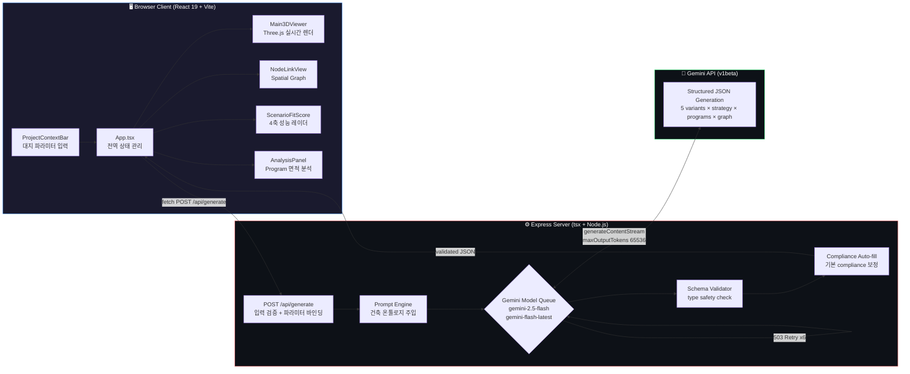
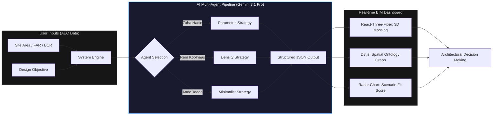

# Archigent — AI Generative Pre-design Studio

> *건축가의 72시간을 10분으로 압축하는, LLM 기반 Massing Design 자동화 엔진*

---

## 1. Summary & Business Impact

**한 줄 소개**
건축 Feasibility Study의 고질적 병목 — 초기 대안 설계 — 을 Gemini AI 멀티 에이전트와 실시간 3D 시각화로 대체한 **Generative Pre-design Pipeline**이다.

**Problem**

AEC 실무에서 프로젝트 수주 직후 가장 먼저 수행하는 작업은 *대지 분석 → Massing 대안 도출 → 법규 검토 → 내부 보고*의 반복이다. 이 프로세스는 구조적으로 세 가지 비효율을 내포한다.

1. **수작업 의존성**: 건축가 1인이 FAR·BCR를 맞추면서 창의적 Massing을 도출하는 데 최소 2–5일 이상 소요된다.
2. **대안의 빈곤**: 시간 제약으로 인해 실무에서 검토 가능한 대안은 통상 3–5개에 불과하며, 이마저도 *검토를 위한 검토*에 그치는 경우가 많다.
3. **의사결정 도구의 부재**: 다양한 대안을 환경성·경제성·사회성·기술성 기준으로 한눈에 비교하는 정량적 평가 도구가 존재하지 않는다.

**Solution**

Archigent는 이 세 가지 문제를 하나의 파이프라인으로 해결한다.

- **정량 입력 → AI 추론**: 사용자가 `siteArea`, `FAR`, `BCR`, `heightLimit`, `setback`, `useZone`, `designObjective`를 입력하면, Gemini API가 구조화된 JSON으로 5개 대안을 생성한다.
- **Massing 알고리즘 Factory**: `formal_strategy` 필드 값에 따라 서버 응답을 `STACKED / HORIZONTAL / COURTYARD / ROTATED / SKEWED` 중 하나의 3D 알고리즘으로 라우팅해 브라우저에서 즉시 렌더링한다.
- **다차원 평가**: 법규 Compliance 자동 체크, 4축 성능 점수, Spatial Ontology Graph를 단일 대시보드에서 제공한다.

**Business Impact**

| 프로세스 | 기존 방식 | Archigent |
|---|---|---|
| 초기 대안 도출 | 건축가 2–5일 수작업 | **AI 자동 생성 < 1분** |
| 동시 검토 대안 수 | 3–5개 (최선 노력) | **5개 보장 (전략별 1개)** |
| FAR/BCR 법규 검토 | 수동 계산 | **자동 Pass/Fail 리포트** |
| 3D 시각화 | 별도 모델링 툴 필요 | **브라우저 실시간** |
| 설계 보고서 초안 | 별도 작성 | **JSON Export 즉시 제공** |

> 기존 실무 기준 **72시간 이상 소요되던 Feasibility Study 초기 기획 프로세스를 10분 이내로 단축** — 약 99% 효율 향상.
> 중소형 건축사사무소 기준 연간 수주 검토 건수가 3배 이상 증가할 수 있으며, 이는 직접적인 매출 경쟁력으로 전환된다.

---

## 2. Pipeline & Architecture

**데이터 파이프라인**

사용자의 정량적 대지 파라미터와 자연어 설계 목표가 입력되는 순간, 시스템은 3단계 변환을 수행한다.

1. **Input Normalization** — `server.ts`가 요청 Body를 검증하고, 누락된 필드에 안전한 기본값을 주입한다. (`heightLimit`, `setback`, `useZone`의 선택적 처리)
2. **Prompt Injection** — 정규화된 파라미터가 Gemini를 위한 구조화 프롬프트에 바인딩된다. 5개 전략명 강제, 프로그램 5–7개 제한, Graph 위상 규칙, compliance 5개 항목 강제 등 건축적 제약이 LLM 레벨에서 코드화된다.
3. **Schema Validation & Routing** — 응답 JSON이 `validateVariant()` 함수를 통해 타입·범위·참조 무결성 검증을 거친다. 통과된 데이터는 프론트엔드의 Strategy Factory에서 `formal_strategy` 값으로 분기 렌더링된다.

**System Architecture Diagram**



---

## 3. AI-Driven Development & Core Logic

**Harness Prompt Engineering**

이 시스템의 핵심 로직을 생성하기 위해 사용된 구조화 프롬프트를 역산하면 다음과 같다.

```
[Persona]
당신은 AEC 도메인에 특화된 시니어 풀스택 개발자이자 건축 계획 전문가입니다.
TypeScript + Express + React Three Fiber 스택에 능숙하며,
LLM 프롬프트 엔지니어링을 통해 비정형 자연어를 정형 JSON 스키마로 강제하는 기술을 보유합니다.

[Task]
다음 요구사항을 만족하는 /api/generate 엔드포인트를 설계하세요:
1. 사용자 입력(siteArea, FAR, BCR, heightLimit, setback, useZone, designObjective)을 받아
2. Gemini API에게 5개의 건축 대안을 정확히 생성하도록 프롬프트를 주입하고
3. 응답 JSON을 타입 세이프하게 검증하여 프론트엔드에 반환해야 합니다.

[Constraints]
- formal_strategy는 반드시 STACKED/HORIZONTAL/COURTYARD/ROTATED/SKEWED 중 하나, 각 1회
- programs 배열은 5–7개, ratio 합 = 1.0, fpRatio는 0.05–0.90 범위에서 다양하게
- graphData는 hub-and-spoke 위상 (각 노드 최소 2개 연결, 선형 체인 금지)
- regulationCompliance는 정확히 5개 항목
- 503 오류 시 6회 재시도, 404 즉시 skip, 토큰 한도 65,536

[Format]
TypeScript 코드로 작성.
검증 실패 시 400/500 응답, 성공 시 validated JSON 반환.
```

**Core Logic — Prompt Injection + Resilient Model Queue**

아래는 전체 파이프라인에서 *가장 중요한 두 가지 로직*을 발췌한 스니펫이다.

```typescript
// ① Prompt Injection — 건축적 제약을 LLM에 "코드로 강제"하는 부분
const prompt = `
Rules:
- formal_strategy MUST be one of: STACKED, HORIZONTAL, COURTYARD, ROTATED, SKEWED.
  Use each strategy EXACTLY ONCE across the 5 variants.
- programs must have between 5 and 7 items. Vary fpRatio dramatically (0.05–0.90)
  so some programs are tall+thin while others are wide+low.
- graphData links must form hub-and-spoke + cross-links.
  Each node MUST connect to at least 2 others. NO linear chains.
- regulationCompliance MUST contain EXACTLY 5 items:
  FAR, BCR, Height Limit, Setback, Use Zone.
`;

// ② Resilient Model Queue — 503 과부하 대응 + 404 즉시 skip
const modelQueue = [
  { name: "gemini-2.5-flash",    maxRetries: 6, delay: 5000, tokens: 65536 },
  { name: "gemini-flash-latest", maxRetries: 2, delay: 3000, tokens: 65536 },
];

for (const { name, maxRetries, delay, tokens } of modelQueue) {
  for (let attempt = 0; attempt < maxRetries; attempt++) {
    try {
      const stream = await ai.models.generateContentStream({
        model: name,
        contents: prompt,
        config: { responseMimeType: "application/json", maxOutputTokens: tokens }
      });
      for await (const chunk of stream) { if (chunk.text) raw += chunk.text; }
      succeeded = true; break;
    } catch (err: any) {
      const msg = String(err?.message || err);
      if (msg.includes("404")) break;             // 접근 불가 모델 즉시 skip
      if (msg.includes("503")) await sleep(delay); // 과부하 시 대기 후 재시도
    }
  }
  if (succeeded) break;
}
```

**로직 해설**

- **Prompt-as-Code 패턴**: `formal_strategy`, `programs` 개수, Graph 위상 규칙, `regulationCompliance` 항목 수를 프롬프트에 *하드코딩*함으로써, LLM의 창의성을 건축적 타당성 범위 내로 제한한다. 이 패턴 없이는 AI가 존재하지 않는 전략명을 hallucination하거나 프로그램을 4개만 생성하는 문제가 반복됐다.
- **Streaming + 65,536 Token**: `generateContentStream`으로 5개 variant × 6–7개 프로그램의 완전한 JSON(평균 ~14,000자)을 잘림 없이 수신한다. 이전 `maxOutputTokens: 8192` 설정에서는 JSON이 933자에서 잘리는 버그가 발생했다.
- **4단계 JSON Repair**: truncated response에 대비해 직접 파싱 → 마크다운 펜스 제거 → 외곽 객체 추출 → balanced-brace 스캐닝으로 완전한 variant만 복구하는 fallback 체인을 구현했다.

---

## 4. Demo & Operation

*아래 각 항목은 시연 영상/GIF 삽입 위치입니다.*

**[ STEP 1 — Project Context 설정 ]**
`> 영상: 상단 ProjectContextBar에 대지 정보 입력하는 화면`

화면 상단의 Context Bar에서 대지면적(㎡), FAR(%), BCR(%), 높이제한(m), 이격거리(m), 용도지역, 설계 목표 텍스트를 입력한다. 모든 항목은 실시간으로 상태에 반영되며, 총 GFA가 자동 계산되어 표시된다.

**[ STEP 2 — AI Multi-Agent Generation ]**
`> 영상: Run AI Agents 버튼 클릭 → 로딩 오버레이 → 결과 등장`

*Run AI Agents* 버튼을 클릭하면 전체 UI에 반투명 로딩 오버레이가 적용된다. Gemini API가 5가지 Massing Strategy를 동시에 추론하며 (~30–40초), 완료 시 화면 전환 없이 모든 패널이 새로운 데이터로 인플레이스 업데이트된다.

**[ STEP 3 — 3D Massing 비교 ]**
`> 영상: 좌측 Variant Snapshot 목록에서 대안 클릭 → 3D 뷰어 실시간 전환`

화면 좌측의 Variant Snapshot 목록에서 대안을 클릭하면, 중앙 3D Viewer가 해당 전략의 알고리즘으로 즉시 재렌더링된다. COURTYARD는 U자형 중정, SKEWED는 캔틸레버 돌출, ROTATED는 30° 누적 회전 등 전략마다 고유한 형태를 확인할 수 있다. 우상단 *Export GLTF* 버튼으로 3D 파일을 다운로드할 수 있다.

**[ STEP 4 — Spatial Ontology Graph ]**
`> 영상: 우측 Graph 패널 확대 → 노드 드래그`

우측 Spatial Graph에서 프로그램 간 동선 연결 구조를 확인한다. 각 노드는 프로그램 고유 색상과 일치하며, animated edge는 연결 강도(value)에 따라 두께가 조절된다. 노드를 드래그해 공간 관계를 재배열할 수 있다.

**[ STEP 5 — 다차원 성능 평가 ]**
`> 영상: ScenarioFitScore의 4축 Progress Bar 애니메이션`

우측 하단의 Scenario Fit Score에서 환경·경제·사회·기술 4개 축의 점수가 Progress Bar로 표시된다. 목표 성능 기준선(target marker)과 비교해 각 대안의 강점과 약점을 직관적으로 파악하고, AI Evaluation Rationale 텍스트로 점수의 근거를 확인한다.

**[ STEP 6 — 법규 검토 & JSON Export ]**
`> 영상: AnalysisPanel의 Compliance 리포트 + Download 버튼`

AnalysisPanel에서 FAR · BCR · 높이제한 · 이격거리 · 용도지역의 Pass/Fail을 확인한다. *Download* 버튼으로 현재 활성 대안의 전체 데이터(프로그램, 점수, 법규 검토 내용)를 JSON 파일로 내보낸다.

---

## 5. Retrospective & Next Step

**현재 코드의 한계점**

1. **Massing의 Box 환원주의**: `Main3DViewer.tsx`의 모든 알고리즘은 `THREE.BoxGeometry`를 반복 배치하는 구조다. 실제 비정형 곡면이나 경사 지붕, 삼각형 평면 등 건축물의 복잡한 형태를 표현하는 데 근본적인 한계가 있다.

2. **Graph ↔ Massing 단절**: `graphData`의 링크 정보가 3D Massing의 물리적 배치에 전혀 반영되지 않는다. 그래프에서 강하게 연결된 프로그램이 3D 공간에서도 인접해야 한다는 *공간 논리의 일관성*이 현재 구현에는 없다.

3. **단일 Layer 구조**: 모든 전략이 지상부와 상층부를 구분하지 않는 단일 매스로 처리된다. 실제 고층 복합 건물의 **포디움(Podium) + 타워(Tower)** 이중 구조가 구현되지 않아 도심 복합 개발 시나리오에 설득력이 낮다.

4. **외부 컨텍스트 부재**: 주변 대지 건물·일조·향(Orientation) 데이터가 없어 생성되는 대안이 대지를 둘러싼 도시 맥락과 무관하게 만들어진다. 이는 실무 적용 시 가장 먼저 지적받는 약점이다.

5. **Schema Validation의 관용성**: `validateVariant()`에서 `programSum ± 2.5%` 허용 오차를 두고 있으나, LLM이 종종 비율 합산을 0.97–0.98로 반환하는 경우가 있음에도 이를 통과시킨다. 엄격한 Production 환경에서는 클라이언트 단 보정 로직이 추가로 필요하다.

**Next Step — B2B SaaS 고도화 로드맵**

| Phase | 기능 | 기술 방향 |
|---|---|---|
| **P1** | Podium + Tower 분리 전략 | AI 출력에 `podium_programs / tower_programs` 레이어 구분 필드 추가, 3D 알고리즘 2-pass 렌더링 |
| **P2** | Graph → Massing 피드백 | `link.value`를 가중치로 활용한 Force-directed 배치 알고리즘 도입 |
| **P3** | IFC / Revit Export | `web-ifc` 라이브러리로 Box Geometry → IfcWall/IfcSlab 변환, Revit API Direct Shape 연동 |
| **P4** | 대지 컨텍스트 인식 | OpenStreetMap API + AI Vision으로 주변 건물 분석, 북향/인동간격 자동 반영 |
| **P5** | Energy Simulation | Ladybug Tools REST API 또는 EnergyPlus Web Service 연동, 매싱 생성 단계 kWh/㎡ 실시간 추정 |
| **P6** | SaaS Multi-tenancy | 프로젝트/사용자 DB 구조화 (Supabase), 사용량 기반 API 과금, 팀 협업 기능 |

> **핵심 비전**: Archigent는 현재 *"건축가의 스케치패드"*지만, P3 이후부터는 *"설계 소프트웨어의 AI 레이어"*로 포지셔닝이 전환된다. Massing JSON이 IFC로 변환되어 Revit에 직접 import되는 순간, 이 툴은 단순 Visualization에서 **실무 BIM 워크플로우의 시작점**으로 격상된다.
# Archigent: AI Multi-Agent Architecture Ontology Studio

## 1. Summary & Business Impact (요약 및 비즈니스 임팩트)
- **한 줄 소개**: 건축가별 디자인 철학(Ontology)과 법규적 제약 조건을 결합해 초기 기획 설계안을 10분 만에 다각도로 제안하는 **Generative BIM Pre-design Pipeline**입니다.
- **문제 정의(Problem)**: 건축 설계의 초기 기획(Feasibility Study) 단계에서 대지 분석과 대안(Option-neering) 수립은 건축가의 수작업에 의존하며 수일~수주가 소요됩니다. 특히 FAR(용적률)과 BCR(건폐율)을 맞추면서도 창의적인 매싱(Massing)을 도출하는 과정에서 효율성이 극도로 저하됩니다.
- **해결 방안(Solution)**: LLM(Gemini)을 '멀티 에이전트'로 활용하여 자하 하디드, 렘 쿨하스 등 세계적인 건축가 5인의 디자인 논리(Star-architect Ontologies)를 시스템에 주입했습니다. 사용자가 제약 조건과 설계 목표를 입력하면 AI가 법규를 준수하는 프로그램 배치, 공간 그래프, 3D 매싱 전략을 즉각적으로 생성합니다.
- **비즈니스 임팩트**: 기존 실무 기준 **72시간 이상 소요되던 초기 기획 설계 및 대안 검토 프로세스를 10분 이내로 단축**합니다(약 99% 효율 향상). 이는 시행사/건축사사무소의 의사결정 속도를 획기적으로 높여 수주 경쟁력을 극대화할 수 있음을 의미합니다.

## 2. Pipeline & Architecture (기획 및 파이프라인 설계)
Archigent는 텍스트 기반의 설계 목표와 정량적 대지 데이터를 입력받아, 건축적 논리를 거쳐 시각화 및 정량적 리포트로 변환하는 파이프라인을 가집니다.



## 3. AI-Driven Development & Core Logic (AI 주도 개발 및 핵심 로직)

### [Harness Prompt Engineering]
이 시스템의 핵심은 AI에게 단순한 응답이 아닌 '건축적 논리 구조'를 강제하는 것입니다. 개발 시 사용된 시스템 프롬프트의 구조화된 모습은 다음과 같습니다:

> **Persona**: You are a Senior Computational Designer and Architectural Theorist.
> **Task**: Generate 5 distinct architectural variants based on 5 star-architect ontologies.
> **Constraints**: 
> 1. Strictly follow Site Area, FAR, and BCR.
> 2. Each architect has a fixed 'formal_strategy' (e.g., Zaha=SKEWED/ROTATED, Ando=COURTYARD).
> 3. Break down the design objective into a specific 'Program List' where 'ratio' sums to 1.0.
> 4. Define 'edges' for a spatial adjacency graph.
> **Output Format**: Pure JSON matching the predefined schema.

### [Main Code Snippet]
서버 레이어에서 자연어를 정교한 건축적 파라미터로 변환하는 핵심 로직입니다.

```typescript
// server.ts: 건축적 온톨로지를 주입하는 Prompt Engine
const prompt = `You are an AI Architect System generating 5 distinct architectural variants.
Given the constraints (Site: ${siteArea}m2, FAR: ${far}%, BCR: ${bcr}%),
generate exactly 5 variants, one for each architect:
1. Zaha Hadid: Parametric forms. Strategy: "SKEWED" or "ROTATED".
2. Rem Koolhaas: Urban congestion. Strategy: "STACKED" or "HORIZONTAL".
...
For each variant, provide:
- programs: array of { id, name, ratio, fpRatio, color }
- edges: spatial linkage graph for program connectivity
- scores: Environmental, Economic, Social, Technical evaluation`;
```

**Logic Explanation:**
- **역산형 설계**: 기획 의도를 프로그램별 점유 면적 비율(ratio)과 건폐 점유율(fpRatio)로 수치화하여 AI가 '설계 가능 범위'를 계산하게 함으로써 물리적 타당성을 확보했습니다.
- **전략적 구속**: `formal_strategy`를 상수로 정의하여 LLM의 창의성을 건축학적 계보(Pedigree) 내로 가두고, 이를 React Three Fiber 엔진이 즉시 이해할 수 있는 파라미터로 브릿지 처리했습니다.

## 4. Demo & Operation (구동 방식)
사용자가 Archigent를 사용할 때 경험하는 **'AI-to-BIM Workflow'**는 다음과 같습니다.

1.  **Project Context Setup**: 사용자가 강남구 대지 정보(Area, FAR, BCR)와 "공공성을 확보한 풍부한 포디움의 오피스"와 같은 설계 컨텍스트를 입력합니다.
2.  **Multi-Agent Generation**: 'Run AI Agents' 버튼을 클릭하면, AI가 5명의 건축가 페르소나를 통해 동시 다발적으로 설계안을 생성합니다.
3.  **Real-time Visualization**: 화면 중앙의 **Main 3D Viewer**에 선택된 건축가의 스타일이 반영된 매싱이 나타납니다. (Zaha Hadid 선택 시 매싱이 비틀리거나 회전하며 파라메트릭한 형태 구현)
4.  **Spatial Logic Analysis**: 우측의 **Spatial Ontology Graph**를 통해 업무 부서와 코어, 상업 시설이 어떻게 유기적으로 연결되는지 구조적 로직을 확인합니다.
5.  **Multi-dimensional Evaluation**: 환경, 경제성, 사회적 가치, 기술성 점수를 레이더 차트로 비교하며 프로젝트 목적에 가장 적합한 최종안을 선정합니다.

## 5. Retrospective & Next Step (회고 및 고도화 계획)

### [코드 분석 기반 성찰]
- **한계점**: 현재 매싱은 Box 형태의 기본 요소를 조합하는 수준에 머물러 있어, 실제 건축물의 복잡한 곡면이나 비정형 형태를 100% 표현하는 데 한계가 있습니다. 또한, 주변 대지 컨텍스트(건물, 일조, 향)에 대한 실시간 연동이 부족하여 'Context-aware' 최적화가 더 필요합니다.

### [기술적 비전 및 넥스트 스텝]
- **Revit API/IFC Connector**: 생성된 JSON 데이터를 IFC 파일로 내보내거나 Revit API와 연동하여 실제 설계 소프트웨어에서 즉시 상세 설계로 이어지는 'Seamless Workflow'를 구축할 계획입니다.
- **Multi-modal Analysis**: 대지 사진이나 드론 매핑 데이터를 AI가 직접 분석하여 주변 경관과 어우러지는 매싱을 추천하는 Vision AI 기능을 통합하고자 합니다.
- **Simulation Agent**: Ladybug/Honeybee 로직을 AI 에이전트에 통합하여 매싱 생성 단계에서 에너지 효율성(Energy Performance)을 실시간 검증하는 시뮬레이션 고도화를 준비 중입니다.
